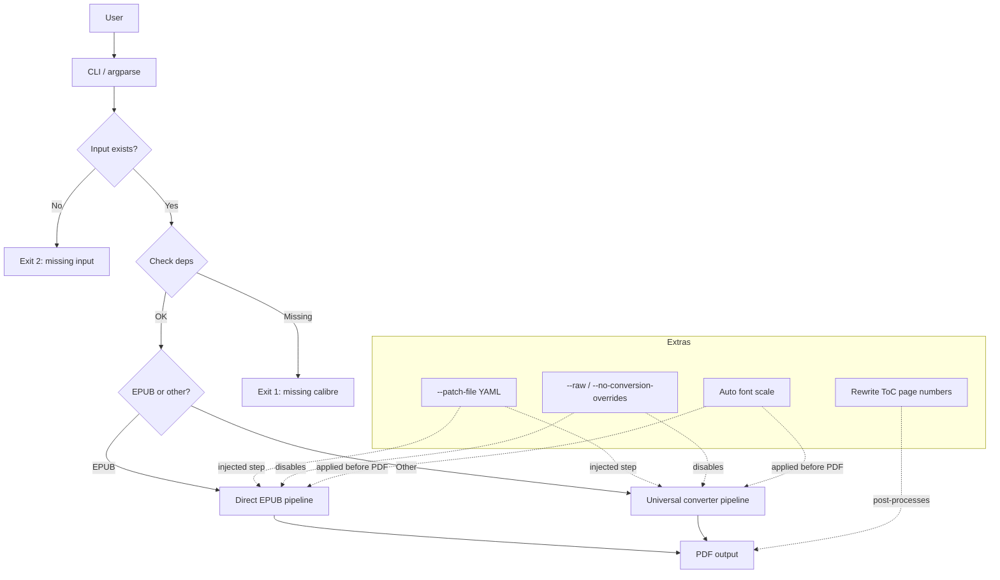
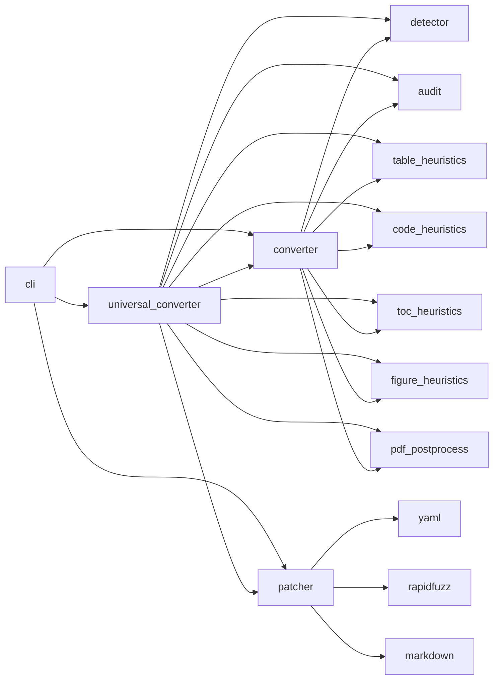
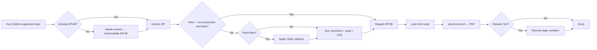
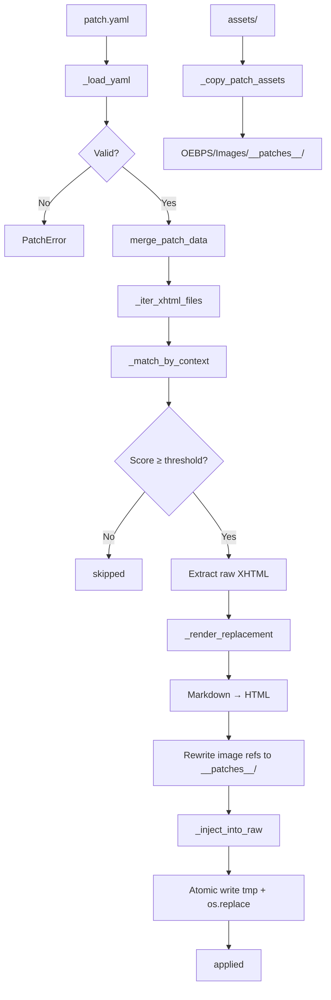
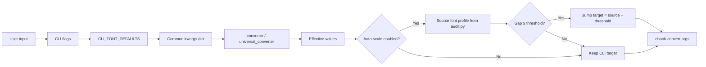

# ebook2pdf Design Document

This document describes the architecture, data flow, module boundaries,
pipeline modes, and extension points in `ebook2pdf`. It is intended for
maintainers and advanced users who want to understand or extend the tool.

## 1. High-Level Architecture



## 2. Module Dependency Map



## 3. Pipeline Modes

### 3.1 Direct EPUB Pipeline

```mermaid
%% Direct EPUB pipeline
flowchart LR
    input_epub[Input EPUB] --> extract[Extract ZIP]
    extract --> table_recovery[Table recovery heuristics]
    table_recovery --> code_recovery[Code block recovery]
    code_recovery --> audit[Font/margin audit]
    audit --> detector[Publisher detection]
    detector --> toc_norm[ToC normalization]
    toc_norm --> caption_norm[Caption normalization]
    caption_norm --> css[Inject comprehensive CSS]
    css --> raw_check{Raw / --no-conversion-overrides?}
    raw_check -->|Yes| repack[Repack EPUB]
    raw_check -->|No| patch_check{Patch files?}
    patch_check -->|Yes| patch[Apply YAML patches]
    patch_check -->|No| repack
    patch --> repack
    repack --> auto_scale[Auto font scale]
    auto_scale --> ebook_convert[ebook-convert → PDF]
    ebook_convert --> toc_rewrite{Rewrite ToC?}
    toc_rewrite -->|Yes| pypdf[Rewrite page numbers]
    toc_rewrite -->|No| done[Done]
    pypdf --> done
```



### 3.2 Universal Converter Pipeline



## 4. Patch Mode Data Flow



## 5. Key Class/Module Responsibilities

### 5.1 `cli.py`
- Defines `CLI_FONT_DEFAULTS` as source-of-truth defaults
- Builds argparse parser with all flags
- Maps user inputs to converter/patcher kwargs
- Early dependency check via `check_dependencies()`
- Dispatches single-file vs batch mode

### 5.2 `converter.py`
- `convert_single()`: Direct EPUB → PDF pipeline
- `_extract_epub()`: ZIP extraction into work_dir
- `_inject_css()`: Appends comprehensive CSS bundle to all `.css` files
- `_inject_css_reference()`: Adds manifest/spine references when no CSS exists
- `_repack_epub()`: Rebuilds EPUB with mimetype-first zip ordering
- `_ebook_convert()`: Invokes Calibre `ebook-convert` with tuned options
- Auto-font-scaling logic at end of pipeline

### 5.3 `universal_converter.py`
- `universal_convert()`: Any format → EPUB → PDF
- `universal_convert_batch()`: Directory conversion using universal path
- `normalize_to_epub()`: Pre-converts non-EPUB inputs via Calibre
- `SUPPORTED_INPUT_FORMATS`: Calibre-readable formats
- Orchestrates recovery, audit, CSS, patches, PDF conversion

### 5.4 `patcher.py`
- `_load_yaml()`: Load and shallow-validate YAML structure
- `_resolve_assets_dir()`: Determine patch assets directory
- `_render_replacement()`: Markdown → XHTML via `markdown` lib
- `_iter_xhtml_htmlfiles()`: Flatten EPUB XHTML files for matching
- `_match_by_context()`: Fuzzy context matching via `rapidfuzz`
- `_inject_into_raw()`: Regex-based block replacement in raw XHTML
- `_copy_patch_assets()`: Copy images into EPUB `__patches__` namespace
- `apply_patch()`: Public API; merges multiple YAMLs, applies patches

### 5.5 `audit.py`
- Pre-flight font and margin checks
- `source_font_profile`: Extracts representative body/code/heading sizes
- Auto-fixes for margin violations

### 5.6 `pdf_postprocess.py`
- Post-conversion ToC page-number rewriting via `pypdf`

## 6. File Layout

```
/home/sysadmin/tmp/ebook2pdf/
├── src/ebook2pdf/
│   ├── __init__.py             # Version
│   ├── __main__.py             # python -m ebook2pdf
│   ├── cli.py                  # CLI parser and dispatcher
│   ├── converter.py            # EPUB -> PDF pipeline
│   ├── universal_converter.py  # Any format -> EPUB -> PDF pipeline
│   ├── patcher.py              # YAML-driven user patches
│   ├── detector.py             # Publisher detection heuristics
│   ├── table_heuristics.py     # Table recovery
│   ├── code_heuristics.py      # Code block detection
│   ├── audit.py                # Font/margin audit + source profiling
│   ├── pdf_postprocess.py      # PDF ToC page-number rewrite
│   ├── font_audit_verify.py    # Post-conversion font verification API
│   ├── font_audit_pymupdf.py   # PyMuPDF span-level font audit
│   ├── figure_heuristics.py    # Caption normalization
│   ├── toc_heuristics.py       # ToC label normalization
│   └── data/
│       ├── comprehensive_fixes.css     # Injected CSS bundle
│       └── pdf-audit-reference.md      # Audit reference docs
├── debian/                     # .deb packaging
├── setup.py                    # Python package config
├── dev.sh                      # Lifecycle helper script
├── README.md                   # User-facing documentation
├── AGENTS.md                   # Session handoff / state
├── plan-patch-mode.md          # Patch-mode implementation plan
├── samples/                    # Sample EPUBs + output PDFs
│   ├── sample-patch.yaml       # Example patch YAML
│   ├── patch-assets/           # Example image assets
│   └── out-app/                # Generated PDFs
└── doc/
    ├── DESIGN.md               # This file
    └── USERGUIDE.md            # End-user guide
```

## 7. Configuration Model



## 8. Extension Points

- New input formats: Add to `SUPPORTED_INPUT_FORMATS` in `universal_converter.py`.
- New patch block types: Extend `ALLOWED_BLOCK_TYPES` in `patcher.py` and add renderer branch.
- New heuristic modules: Wire into `universal_converter.py` and `converter.py` pipeline steps.
- New post-processing: Add a step after `_ebook_convert()` in both converters.
- New CLI flags: Add to `cli.py`, include in `common_kwargs`, and forward in converter signatures.

## 9. Testing Strategy

- Unit tests for `patcher.py`: YAML loading, validation, context matching, asset copying.
- Unit tests for `audit.py`: Source font profile extraction, threshold logic.
- Integration tests via `dev.sh test` and `dev.sh font-audit` on sample EPUBs.
- Regression tests: Verify `check_matching_defaults()` warns on drift.
- Snapshot tests: Golden `.deb` artifact names, remotes, binary paths.
