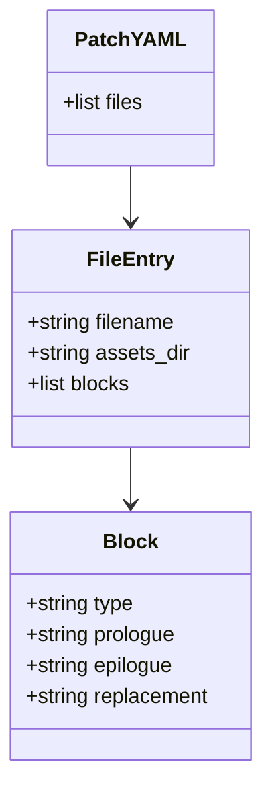
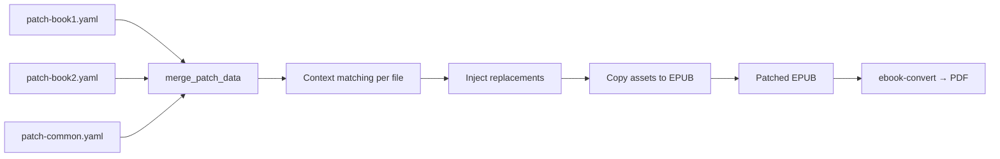
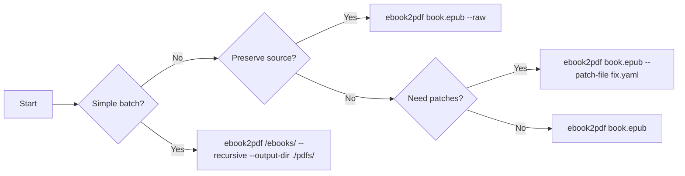

# ebook2pdf User Guide

This guide covers installation, basic and advanced usage, patch mode, troubleshooting, and common workflows.

## 1. What ebook2pdf Does

`ebook2pdf` converts ebooks to PDF with automatic formatting fixes:

- **Typography**: Enforces readable minimum font sizes with optional auto-scaling for small-source text.
- **Content recovery**: Detects and restores tables, code blocks, and figures that often degrade during conversion.
- **Publisher awareness**: Adjusts CSS heuristics based on detected book source (Manning, Wiley, Rheinwerk, etc.).
- **Table of contents**: Generates a PDF ToC page with right-aligned page numbers and supports post-conversion page-number rewriting.
- **Patch mode**: Lets users manually override problematic regions with YAML-described replacements.
- **Universal input**: Accepts any format Calibre can read, including PDF input for rerun/repair workflows.

## 2. Installation

### 2.1 System-wide Debian Package

```bash
# Build .deb
cd /home/sysadmin/tmp/ebook2pdf
./dev.sh deb

# Install
sudo dpkg -i /home/sysadmin/tmp/ebook2pdf_1.0.0-1_all.deb

# Verify
ebook2pdf --version
```

### 2.2 Editable Install

```bash
cd /home/sysadmin/tmp/ebook2pdf
./dev.sh setup
source .venv/bin/activate
python -m ebook2pdf --version
```

### 2.3 Dependencies

- `calibre` (provides `ebook-convert`)
- `python3-pypdf`
- `python3-pymupdf` (optional, for font auditing)

## 3. Quick Start

### 3.1 Convert a Single EPUB

```bash
ebook2pdf book.epub
```

Output: `book.pdf` in the same directory as `book.epub`.

### 3.2 Convert a Directory

```bash
ebook2pdf /path/to/ebooks/ --recursive --output-dir /path/to/pdfs/
```

This walks all subdirectories and writes PDFs into `/path/to/pdfs/`.

## 4. Common Workflows

### 4.1 Typography Control

```bash
# Reduce density for large-format technical books
ebook2pdf book.epub --font-size 12 --body-font-size 11 --mono-font-size 10 --margin 24

# Enforce strict minimums and disable auto-scaling
ebook2pdf book.epub --font-size 14 --body-font-size 13 --mono-font-size 11 \
  --no-auto-font-scale
```

### 4.2 Batch Conversion

```bash
ebook2pdf /home/sysadmin/ebooks/ \
  --recursive \
  --output-dir /home/sysadmin/pdfs/ \
  --font-size 13 \
  --margin-top 40 \
  --margin-bottom 40
```

### 4.3 Preserve Source Settings

```bash
ebook2pdf book.epub --raw
```

Use `--raw` when the source layout is already good and you want to skip injected CSS, recovery passes, and auto-scaling.

### 4.4 Repair a PDF Input

```bash
ebook2pdf scanned.pdf --force-universal -o repaired.pdf --raw
```

The universal pipeline reruns Calibre conversion with recovery passes applied to the intermediate EPUB.

## 5. Patch Mode Guide

Patch mode uses YAML files to describe manual replacements for problematic tables, code blocks, or figures.

### 5.1 Directory Layout

```
project/
├── book.epub
├── patches/
│   ├── tables.yaml
│   └── code.yaml
└── assets/
    ├── circuit.png
    └── screenshot.jpg
```

### 5.2 Basic Example

```yaml
# patches/tables.yaml
files:
  - filename: "book"
    blocks:
      - type: table
        prologue: |
          The following table summarizes the protocol stack:
        epilogue: |
          Table 3.2: Protocol stack overview
        replacement: |
          | Layer | Protocol | Port |
          |-------|----------|------|
          | App   | HTTP     | 80   |
          | Trans | TCP      | -    |
          | Net   | IP       | -    |
```

### 5.3 Code Block Example

```yaml
files:
  - filename: "book"
    blocks:
      - type: code-block
        prologue: |
          The server is initialized with default settings:
        epilogue: |
          The server listens on port 8080.
        replacement: |
          ```python
          server = Server(host="0.0.0.0", port=8080)
          server.run()
          ```
```

### 5.4 Figure Example

```yaml
files:
  - filename: "book"
    assets_dir: "./assets"
    blocks:
      - type: figure
        prologue: |
          Figure 4.1 shows the circuit layout.
        epilogue: |
          The layout follows standard breadboard conventions.
        replacement: |
          
```

### 5.5 Multiple Patches

```bash
# Apply multiple patch files in one conversion
ebook2pdf book.epub \
  --patch-file ./patches/tables.yaml \
  --patch-file ./patches/code.yaml \
  --patch-file ./patches/figures.yaml \
  -o book-patched.pdf
```

### 5.6 YAML Schema Summary



| Field | Required | Description |
|-------|----------|-------------|
| `files` | Yes | List of file entries |
| `filename` | Yes | Source ebook basename, with or without extension |
| `assets_dir` | No | Image directory; defaults to `./assets` next to YAML |
| `blocks` | Yes | List of override regions |
| `type` | Yes | `table`, `code-block`, or `figure` |
| `prologue` | Yes | Text immediately before the target block |
| `epilogue` | Yes | Text immediately after the target block |
| `replacement` | Yes | Markdown content replacing the block |

### 5.7 Image Asset Rules

- Place images in `./assets/` next to the patch YAML, or set `assets_dir` explicitly.
- Reference images by filename in Markdown: ``.
- The pipeline copies assets into `OEBPS/Images/__patches__/` and rewrites the rendered XHTML automatically.

### 5.8 Batch Patch Workflow



## 6. Command Reference

### 6.1 Positional Argument

| Argument | Description |
|----------|-------------|
| `input` | Ebook file or directory containing ebook files |

### 6.2 Output Options

| Flag | Description |
|------|-------------|
| `-o OUTPUT`, `--output OUTPUT` | Output PDF path (single file) or output directory (batch) |

### 6.3 Format Options

| Flag | Description |
|------|-------------|
| `--format INPUT_FORMAT` | Input format override (e.g. pdf, mobi, epub). Default: auto-detect by extension |
| `--output-format OUTPUT_FORMAT` | Output format. Currently only PDF is supported (default: pdf) |
| `--force-universal` | Force the universal multi-format pipeline even for EPUB inputs |

### 6.4 Font Options

| Flag | Description |
|------|-------------|
| `--font-size SIZE`, `--base-font-size SIZE` | Base font size in pt (default: 14) |
| `--body-font-size SIZE` | Body text font size in pt (default: 13) |
| `--mono-font-size SIZE` | Monospace/code font size in pt (default: 11) |

### 6.5 Margin Options

| Flag | Description |
|------|-------------|
| `--margin MARGIN` | Uniform page margin in pts (overrides individual margin settings) |
| `--margin-top SIZE` | Top margin in pts (default: 36) |
| `--margin-bottom SIZE` | Bottom margin in pts (default: 36) |
| `--margin-left SIZE` | Left margin in pts (default: 36) |
| `--margin-right SIZE` | Right margin in pts (default: 36) |

### 6.6 Batch Options

| Flag | Description |
|------|-------------|
| `-r`, `--recursive` | Search directories recursively for ebook files |
| `--output-dir DIR` | Output directory for batch conversions |

### 6.7 Behavior Flags

| Flag | Description |
|------|-------------|
| `--no-page-numbers` | Disable page number footer in PDF |
| `--rewrite-toc-page-numbers` | After conversion, rewrite PDF ToC entries to actual page numbers |
| `--no-auto-font-scale` | Disable automatic font-size upscaling for small-source fonts |
| `--auto-font-scale-threshold N` | Minimum pt gap between source and requested font to trigger scaling (default: 2) |
| `--raw` | Passthrough mode: disable all injected overrides and use source ebook conversion settings |
| `--no-conversion-overrides` | Disable ALL conversion overrides, including user-applied patches |
| `--force-universal` | Force the universal multi-format pipeline even for EPUB inputs |
| `--patch-file PATH` | Path to a YAML patch file. May be specified multiple times |
| `--no-toc` | Disable auto-generated Table of Contents page |
| `-v`, `--verbose` | Show detailed progress information |
| `--version` | Show version information and exit |

## 7. Troubleshooting

### 7.1 Patch Not Applied

- Tighten `prologue` and `epilogue` text; include a unique phrase adjacent to the bad block.
- Run with `--verbose` to see patch statistics and skipped counts.
- EPUB context may differ from source book text; copy exact surrounding text from the extracted EPUB when possible.

### 7.2 Small Fonts in Output

- Re-run with explicit font overrides:
  ```bash
  ebook2pdf book.epub --font-size 14 --body-font-size 13 --mono-font-size 11
  ```
- Disable auto-scaling to verify source behavior:
  ```bash
  ebook2pdf book.epub --no-auto-font-scale --font-size 14 --body-font-size 13 --mono-font-size 11
  ```
- Inspect the intermediate EPUB manually if font issues persist; Calibre may flatten unusual CSS.

### 7.3 Calibre Not Found

```bash
sudo apt-get install -y calibre
```

### 7.4 Permission / Install Issues

```bash
sudo dpkg -i /home/sysadmin/tmp/ebook2pdf_1.0.0-1_all.deb
ebook2pdf --version
```

### 7.5 Debug Output

```bash
ebook2pdf book.epub -v
```

Use `--verbose` to see pipeline steps, patch statistics, and font-scale decisions.

## 8. Advanced Tips

- Use `--patch-file` multiple times to split large patch sets by concern (tables, code, figures).
- Use `--force-universal` for PDF inputs or uncommon formats so Calibre normalizes content first.
- Use `--no-conversion-overrides` as an escape hatch when troubleshooting formatting regressions introduced by injected fixes.
- Use `--raw` when the source ebook is well-formed and you want a near-1:1 Calibre conversion.
- Keep `epub2pdf-*` runtime CSS class markers in mind if you automate downstream checks on produced PDFs; they are intentional output behavior tokens.

## 9. Example Command Sequences



### 9.1 Minimal Conversion

```bash
ebook2pdf book.epub
```

### 9.2 Verbose Single File

```bash
ebook2pdf book.epub -o output.pdf --verbose
```

### 9.3 Raw Pass

```bash
ebook2pdf book.epub --raw
```

### 9.4 Multiple Patch Files

```bash
ebook2pdf book.epub \
  --patch-file ./fixes/tables.yaml \
  --patch-file ./fixes/code.yaml \
  --patch-file ./fixes/figures.yaml
```

### 9.5 Universal Input

```bash
ebook2pdf book.mobi --format mobi
ebook2pdf scanned.pdf --force-universal -o repaired.pdf --raw
```

### 9.6 Typography Tuning

```bash
ebook2pdf book.epub \
  --font-size 12 \
  --body-font-size 11 \
  --mono-font-size 10 \
  --margin 24
```

### 9.7 Disable Auto-Scaling

```bash
ebook2pdf book.epub \
  --no-auto-font-scale \
  --font-size 14 \
  --body-font-size 13 \
  --mono-font-size 11
```

### 9.8 Batch Convert

```bash
ebook2pdf /home/sysadmin/ebooks/ \
  --recursive \
  --output-dir /home/sysadmin/pdfs/
```

### 9.9 Rewrite ToC Page Numbers

```bash
ebook2pdf book.epub --rewrite-toc-page-numbers -o book-indexed.pdf
```

### 9.10 Escape Hatch

```bash
ebook2pdf book.epub --no-conversion-overrides
```
